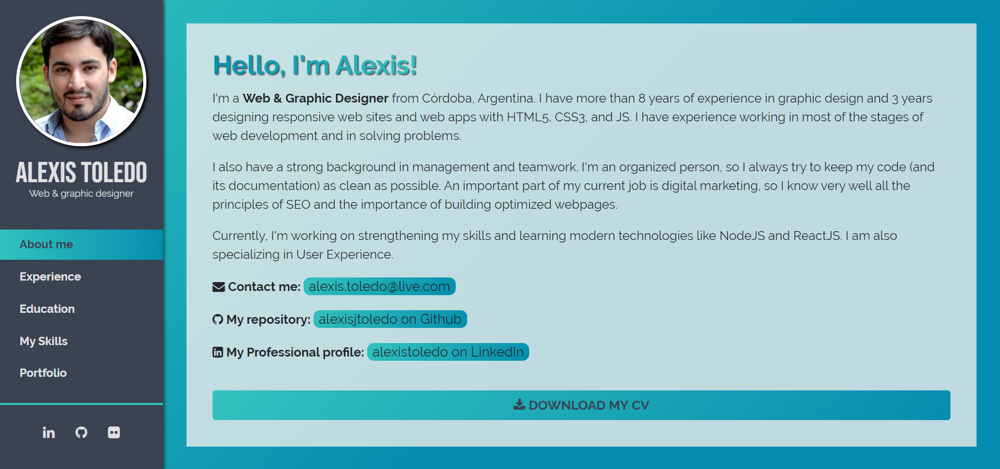
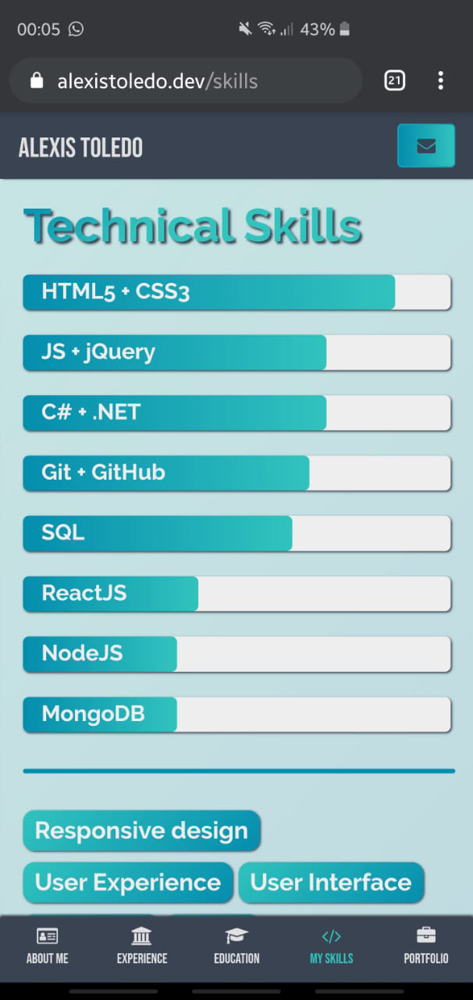
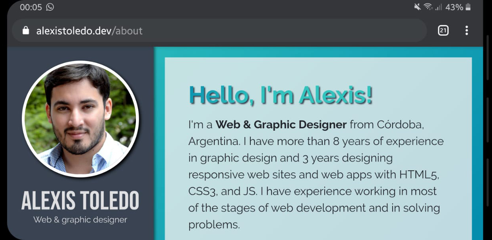

# Alexis Toledo Resume

This is my Portfolio, a virtual space I've created to show my work in different sections through the years. It is a responsive website made by me using ReactJS. I also used Bootstrap 4 as a base but most of the styles are written in a customized CSS3 stylesheet.

## Built With

- [ReactJS](https://reactjs.org/)
- [jQuery](https://jquery.com/)
- [Bootstrap 4](https://getbootstrap.com/)
- [Font Awesome 4](https://fontawesome.com/v4.7.0/)
- [GitHub Pages](https://pages.github.com/)

## Live view

[Visit my website!](https://alexistoledo.dev)

## Web

## Mobile

